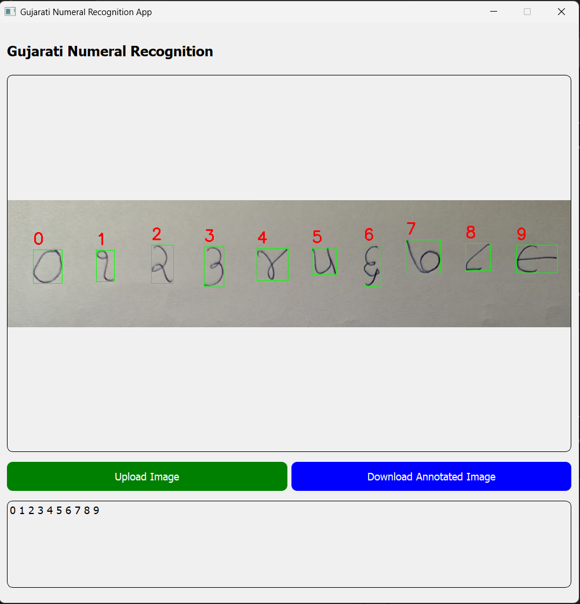
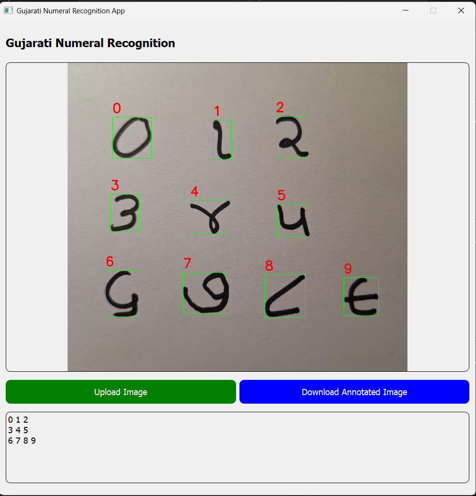

# Gujarati Handwritten Digit Recognition

This project involves the development of a machine learning model to recognize handwritten Gujarati digits using deep learning techniques. The model is designed to classify digits written in the Gujarati script, providing an efficient solution for applications that require handwritten digit recognition, such as automated data entry and document digitization. I have also uploaded the dataset to Kaggle:
[Kaggle Link to the Dataset](https://www.kaggle.com/datasets/jaymistry456/gujarati-handwritten-digits-dataset)

## Project Overview
The goal of this project is to build a model capable of recognizing Gujarati handwritten digits from images. The model was trained on a custom dataset consisting of over 20,000 handwritten digits by 16 individuals, and it is capable of identifying digits in images with varying handwriting styles. The project focuses on the following objectives:
- Data collection and preprocessing
- Model design and training
- Evaluation and performance analysis

## Installation

To run this project, you need to have Python (preferrably Python 3.11.0, if you get errors while installing dependencies- https://www.python.org/downloads/release/python-3110/) installed on your machine along with the necessary dependencies. You can install the required packages using `pip` by following these steps:

1. Clone this repository (Use HTTPS or SSH):
   ```bash
   git clone https://github.com/jaymistry456/gujarati-handwritten-numeral-recognition.git
   git clone git@github.com:jaymistry456/gujarati-handwritten-numeral-recognition.git
   cd gujarati-handwritten-numeral-recognition
2. Set up a virtual environment:
   ```bash
   python -m venv myprojectenv
   source myprojectenv/bin/activate  # On Windows, use source .\myprojectenv\Scripts\activate
3. Install the required dependencies:
   ```bash
   pip install -r requirements.txt
4. To run the Jupyter Notebook, run the following command and open the model.ipynb file to see the python notebook in jupyter lab:
   ```bash
   jupyter lab
5. To run the PyQT application, run the following command from the project folder:
   ```bash
   python app.py
## Usage
The PyQT application demonstrates a way to use the model in real-world application:
1. The user can upload an image from the computer into the application using the "Upload Image" button. There is a "test_images" folder which contains 3 images for testing purposes.
2. The image will be processed and annotated with the corresponding digits.
3. The user can download the annotated image into their computer using the "Download Annotated Image" button.
4. The recognized digits will also be visible in the bottom section of the application, ordered from top-left of the image to the bottom-right.




